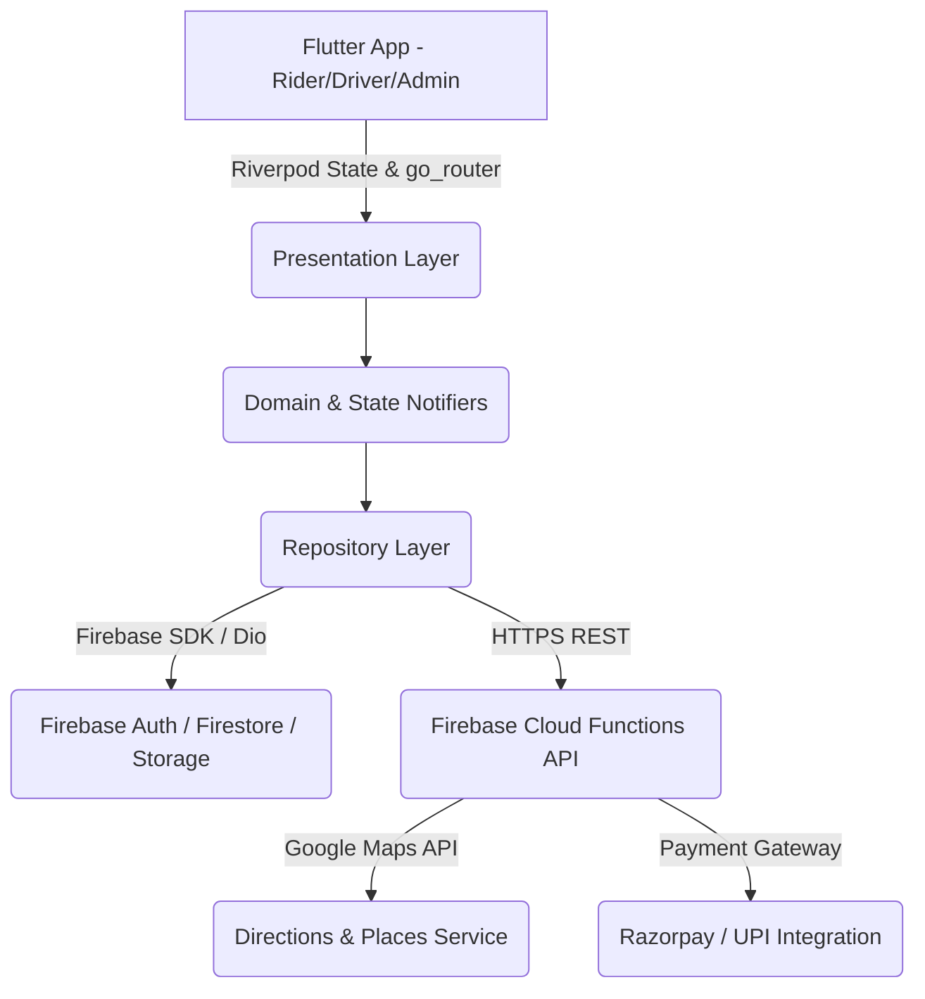

# Payano Architecture & Design System

## High-Level System Architecture



## Clean Architecture Layers

1. **Presentation Layer (`lib/features/*/presentation`)**: Flutter UI widgets, custom bottom sheets, interactive maps, and responsive layouts built with Material 3.
2. **Domain Layer (`lib/features/*/domain`)**: State Notifiers (`RideNotifier`, `RideState`), Business Rules, and State Machine logic.
3. **Data & Service Layer (`lib/core/services`)**: `AuthService`, `LocationService`, `MapsService`, Firebase Firestore bindings, and Local Storage (`flutter_secure_storage`).

## Ride State Machine

```
[REQUESTED] ──> [SEARCHING] ──> [DRIVER_ASSIGNED] ──> [DRIVER_ARRIVING] ──> [DRIVER_ARRIVED] ──> [TRIP_STARTED] ──> [TRIP_COMPLETED]
     │               │                 │                    │                   │
     └──[CANCELLED]──┴───[CANCELLED]───┴────[CANCELLED]─────┴───[CANCELLED]─────┘
```
